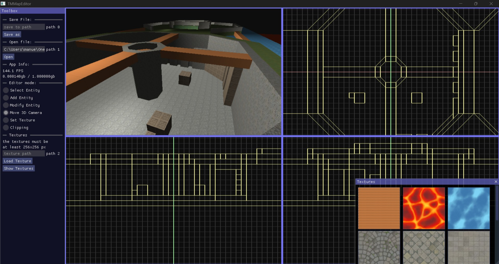

TMMapEditor, a 3D level editor inspired by the classic Hammer editor

    Fueatures:

    -   Add Geometry

    -   Remove Geometry

    -   Modify Geometry

    -   Clip Geometry using planes

    -   Add Textures to Geometry

    -   Multi Viewport user interfacer

    -   Download the last Version from Releases

